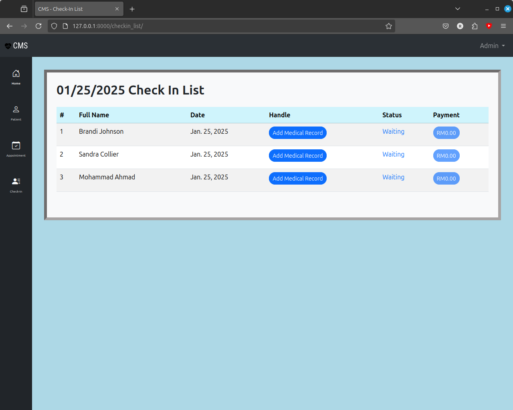

# Clinic Management System [WIP]

This is my Diploma Final Year Project, the aim for this system is to create all-in-one management system for clinic. The main features for this system are:
1. Login.
2. Patient List.
3. Patient Detail.
4. Appointment List.
5. Check-in List (to handle daily customers/patients check-in).
6. Medical Record Handling.
7. Payment.

Frontend:

1. HTML
2. Bootstrap5
3. CSS

Backend:

1. Django
2. Sqlite3 for database

Target Users:
1. Clinic Staffs
2. Doctors

## Hows To

Clone this repo  
`git clone https://github.com/rahimi-mohd/clinic-management-system.git`

Create virtual env (Optional but recommended)  
`$ python -m venv venv`

Install requirements  
`$ pip install -r requirements.txt`

Setup database  

```
./manage makemigrations
./manage migrate
```

**IMPORTANT**: Create super user
`$ ./manage createsuperuser`  
You will be prompt with username, email, and password. And you have to use this account for first log in.  

Run server  
`$ ./manage runserver`

**NOTE**: There's a debate whether Function Based Views (FBVs) or Class Based Views (CBVs) is better for writing Django application. I choose  FBVs because it make my logic clearer and I find that I can think better by using it--this is clearly matter of personal thought and preference. **END**

## Screenshots

Here are some Clinic Management System main features and functionality screenshot.  

  
Figure 1: Login Page.  

  
Figure 2: Dashboard.  

  
Figure 3: Patient List.  

  
Figure 4: Patient Profile.  

  
Figure 5: Check-in List.  

  
Figure 6: Add Medical Record.  

  
Figure 7: Payment.  


## Functional Test

Functional test instructions have been moved to `./tests/README.md`.  

UPDATED (Jan 2025): I've moved on from using Playwright with Python to Playwright with Typescript. This is because I want to learn typescript and why not learn it while doing an automation project with Playwright ?  

All the code in tests/ will be in typescript.

## Next Plan

1. To add Unit Test.
2. To add test case with functional test using Playwright.
3. Refactor views.
4. Add permission using admin page. (DONE)

